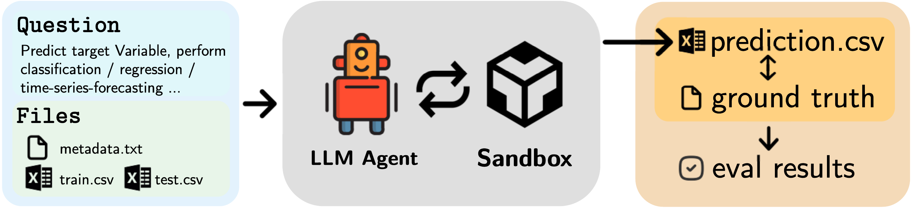

**[ICLR 2026]** DARE-Bench: Evaluating Modeling and Instruction Fidelity of LLMs in Data Science

[](https://arxiv.org/abs/TODO)
[](https://TODO)
[](https://huggingface.co/datasets/Snowflake/dare-bench)

<p align="center">
  <br>
  <sub><em>Figure 1: DARE-Bench task structure. Each task provides a natural-language question and structured files. An LLM agent executes code within a sandbox to generate predictions, which are compared against ground truth for automatic evaluation.</em></sub>
</p>

---

## Authors

**Fan Shu**<sup>1,\*</sup> · **Yite Wang**<sup>2,\*†</sup> · **Ruofan Wu**<sup>1</sup> · **Boyi Liu**<sup>2</sup> · **Zhewei Yao**<sup>2</sup> · **Yuxiong He**<sup>2</sup> · **Feng Yan**<sup>1</sup>

<sup>1</sup>University of Houston &emsp; <sup>2</sup>Snowflake AI Research
<!-- <sup>\*</sup>Equal contribution &emsp; <sup>†</sup>Corresponding author -->

---

## Overview

DARE-Bench is a large-scale benchmark for evaluating LLM agents on data science tasks, featuring **6,300 tasks** across classification, regression, and time series forecasting. Here we make available a subset of the tasks. DARE-Bench provides:

- ✅ **Verifiable ground truth** for objective and reproducible evaluation
- 🎯 **Process-aware instruction following** tasks with deterministic outcomes
- 📊 **Large-scale training data** to support supervised fine-tuning and reinforcement learning

---

## Task Types

| Task Type | Description | Train | Eval |
|:--|:--|--:|--:|
| Classification-IF | Instruction Following | 807 | 68 |
| Classification-MM | ML Modeling | 807 | 68 |
| Regression-IF | Instruction Following | 649 | 42 |
| Regression-MM | ML Modeling | 649 | 42 |
| Time-series-XF | eXogenous Features | 681 | 52 |
| Time-series-CF | Canonical Forecasting | 681 | 52 |
| | **Total** | **4,274** | **324** |

> The table above reflects the tasks released in this repository. 
>
> **Note:** The paper reports results/statistics on the full dataset (Train: **5,948**, Eval: **352**, Total: **6,300**). For the **full dataset** statistics (as reported in the paper), expand the section below.
>
> Task type is inferred from the dataset folder suffix: `*_class` → Classification, `*_reg` → Regression, `*_ts` → Time-series.
>
> See [`LICENSE/LICENSE_DISTRIBUTION.md`](LICENSE/LICENSE_DISTRIBUTION.md) for the license distribution of the released subset (counted using `suggested_license` when present; Train: **2,137** source datasets, Eval: **162** source datasets).
>
> We also provide the license metadata in [`LICENSE/kaggle_license_train.csv`](LICENSE/kaggle_license_train.csv) and [`LICENSE/kaggle_license_test.csv`](LICENSE/kaggle_license_test.csv).

<details>
<summary><strong>Full Dataset (as reported in paper)</strong></summary>

| Task Type | Description | Train | Eval |
|:--|:--|--:|--:|
| Classification-IF | Instruction Following | 1,160 | 74 |
| Classification-MM | ML Modeling | 1,160 | 74 |
| Regression-IF | Instruction Following | 899 | 45 |
| Regression-MM | ML Modeling | 899 | 45 |
| Time-series-XF | eXogenous Features | 915 | 57 |
| Time-series-CF | Canonical Forecasting | 915 | 57 |
| | **Total** | **5,948** | **352** |

</details>

---

## Results

Performance of various LLMs on DARE-Bench evaluation tasks (score in %):

| Model | Class-IF | Class-MM | Reg-IF | Reg-MM | TS-XF | TS-CF |
|:--|:--:|:--:|:--:|:--:|:--:|:--:|
| GPT-4o | 31.86 | 41.10 | 20.63 | 39.74 | 37.09 | 5.24 |
| GPT-4.1 | 55.39 | 57.75 | 50.00 | 57.68 | 41.19 | 6.81 |
| GPT-5 | 70.10 | 43.18 | 55.56 | 55.21 | 36.78 | 7.84 |
| GPT-o4-mini | 68.14 | 59.14 | 51.59 | 57.48 | 42.15 | 8.15 |
| Claude-Sonnet-3.7 | 61.52 | 61.22 | 46.03 | 61.36 | 51.21 | 12.08 |
| Claude-Sonnet-4 | 14.71 | 17.70 | 14.29 | 10.50 | 5.27 | 0.02 |
| Qwen3-32B | 16.67 | 30.92 | 15.08 | 35.42 | 27.26 | 0.00 |
| Qwen3-4B | 3.43 | 4.99 | 0.79 | 2.28 | 7.00 | 0.00 |

> The table above reflects the results of the tasks released in this repository. For the **full evaluation results** (as reported in the paper), expand the section below.

<details>
<summary><strong>Full Evaluation Results (as reported in paper)</strong></summary>

| Model | Class-IF | Class-MM | Reg-IF | Reg-MM | TS-XF | TS-CF |
|:--|:--:|:--:|:--:|:--:|:--:|:--:|
| GPT-4o | 32.88 | 40.45 | 20.28 | 40.60 | 35.54 | 4.77 |
| GPT-4.1 | 55.82 | 57.83 | 52.17 | 58.62 | 40.78 | 6.60 |
| GPT-5 | **69.81** | 43.40 | **57.24** | 56.29 | 36.83 | 10.13 |
| GPT-o4-mini | 67.56 | 57.89 | 53.62 | 57.60 | 42.29 | 9.67 |
| Claude-Sonnet-3.7 | 61.48 | **61.03** | 46.37 | **63.20** | **49.88** | **13.70** |
| Claude-Sonnet-4 | 16.21 | 18.27 | 15.21 | 11.33 | 4.80 | 0.01 |
| Qwen3-32B | 17.11 | 30.71 | 15.21 | 35.86 | 26.96 | 0.00 |
| Qwen3-4B | 3.60 | 5.23 | 0.72 | 3.29 | 6.97 | 0.00 |

</details>

<details>
<summary><strong>Task Variants in JSON</strong></summary>

- For `classification` / `regression` tasks: `question_v1` = IF (Instruction Following), `question_v2` = MM (ML Modeling)
- For `time_series_analysis` tasks: `question_v1` = XF (eXogenous Features), `question_v2` = CF (Canonical Forecasting)

</details>

---

## Data

| Split | Location | Count |
|:--|:--|--:|
| Evaluation | [`data/eval/`](data/eval/) | 324 tasks |
| Training | 🤗 [HuggingFace](https://huggingface.co/datasets/Snowflake/dare-bench) | 4,274 tasks |
| SFT Trajectories | 🤗 [HuggingFace](https://huggingface.co/datasets/Snowflake/dare-bench) | — |

<details>
<summary><strong>SFT Rejection Sampling Strategies</strong></summary>

| Strategy | Description |
|:--|:--|
| **FV** (Fastest-Valid) | Single fastest valid trajectory per task |
| **AV** (All-Valid) | All valid trajectories |
| **BV** (Best-Valid) | Best trajectory from diverse tasks only |
| **DV** (Duo-Valid) | Top-2 trajectories from diverse tasks |

</details>

---

## Quick Start

```python
import json

# Load evaluation tasks
with open("data/eval/question_list.json", "r") as f:
    tasks = json.load(f)

# Example: Get a task (classification / regression / time_series_analysis)
task = tasks[0]
question_if = task["question_v1"]  # Instruction Following
question_mm = task["question_v2"]  # ML Modeling
data_path = f"data/eval/databases/{task['file_path']}"
```

> **Time series tasks:** In `question_list.json`, time series tasks have `task = "time_series_analysis"` (with variants XF/CF in v1/v2). The provided evaluation script matches predictions by `row_id` for **all** tasks (including time series), so your `prediction.csv` must include `row_id` and the target column(s) specified in `verify/all_metadata.json`.

---

## Repository Structure

> `data/eval/databases/` contains dataset files under their **original Kaggle/source licenses**. All other files are released under **Apache-2.0**.

```
dare-bench/
├── data/
│   └── eval/
│       ├── question_list.json
│       └── databases/
├── LICENSE/
├── LICENSE.txt
├── scripts/
│   ├── evaluation.py
│   └── reference_solution.py
├── figs/
└── README.md
```

---

## Evaluation

The evaluation script computes metrics by comparing model predictions against ground truth:

| Task | Metric (v1 - IF/XF) | Metric (v2 - MM/CF) |
|:--|:--|:--|
| Classification | Exact Match | Macro F1 Score |
| Regression | Exact Match | Clipped R² (0-1) |
| Time Series | Clipped R² (0-1) | Clipped R² (0-1) |

> **Prediction format (all tasks, including time series):** `scripts/evaluation.py` expects `prediction.csv` to contain a `row_id` column aligned with `verify/ground_truth.csv`, plus the target column(s) defined in `verify/all_metadata.json`.

```python
from scripts.evaluation import evaluate_prediction

result = evaluate_prediction(
    prediction_path="path/to/prediction.csv",
    ground_truth_path="path/to/ground_truth.csv",
    metadata_path="path/to/all_metadata.json",
    question_version="v2"
)
print(f"Score: {result['final_score']:.2%}")
```

**Batch evaluation:**
```bash
python scripts/evaluation.py \
    --predictions_dir ./predictions \
    --databases_dir ./data/eval/databases \
    --question_list ./data/eval/question_list.json \
    --version v2
```

---

## Reference Solutions

Each task includes parameters in `all_metadata.json` that specify the exact ML pipeline (features, model type, preprocessing) required to generate the ground truth.

> [!IMPORTANT]
> **Ground Truth Generation for IF Tasks**
> For **Classification** and **Regression** Instruction Following (IF) tasks, the expected outputs are deterministic but environment-dependent. Due to variations in hardware, operating systems, and Python package versions (e.g., `scikit-learn`, `numpy`), numerical results may differ slightly across machines.
> Therefore, **you must execute the reference solution code locally** to generate the correct ground truth for your specific environment before running evaluations.

The reference solution generator creates executable Python code from the task metadata:

```python
from scripts.reference_solution import generate_reference_solution_code

# Generate the code
code = generate_reference_solution_code("path/to/all_metadata.json")

# Execute to get local ground truth (required for IF tasks)
exec(code)

```

> The generated reference solution writes `prediction.csv` with `row_id` plus target column(s). This applies to time series tasks as well.

**Generate and execute reference solutions for all tasks:**

```bash
python scripts/reference_solution.py \
    --databases_dir ./data/eval/databases \
    --question_list ./data/eval/question_list.json \
    --output_dir ./reference_solutions \
    --execute  # Flag to run the code and save ground truth

```

The reference solutions are executed in a sandboxed environment with access only to the task's data files.
---

## Citation

```bibtex
@inproceedings{shu2026darebench,
  title={DARE-Bench: Evaluating Modeling and Instruction Fidelity of LLMs in Data Science},
  author={Shu, Fan and Wang, Yite and Wu, Ruofan and Liu, Boyi and Yao, Zhewei and He, Yuxiong and Yan, Feng},
  booktitle={International Conference on Learning Representations},
  year={2026}
}
```


## License

- The `databases/` assets are subject to their **original source licenses** from Kaggle.
- All other files in this repository are released under **Apache-2.0**.

For reference, we provide the license distribution of the released subset in [`LICENSE/LICENSE_DISTRIBUTION.md`](LICENSE/LICENSE_DISTRIBUTION.md). The underlying license metadata is available in [`LICENSE/kaggle_license_train.csv`](LICENSE/kaggle_license_train.csv) and [`LICENSE/kaggle_license_test.csv`](LICENSE/kaggle_license_test.csv).
